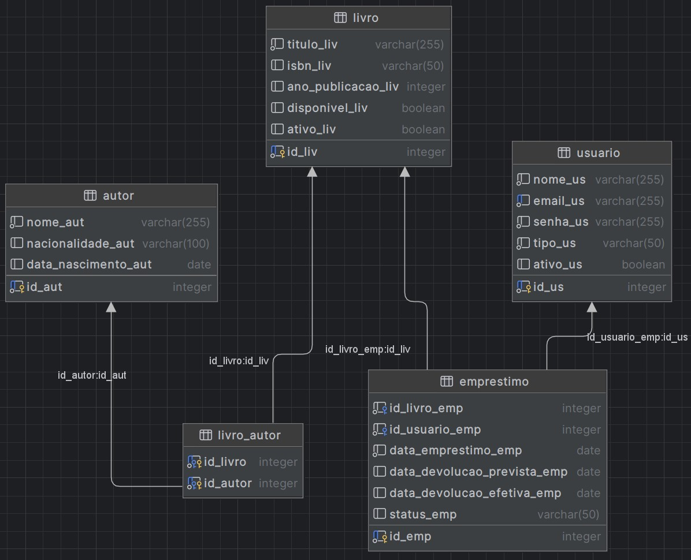

### nome: "primeira_entrega"
#### atualizações:

- [ ] arquivo .pdf com um descritivo do projeto (1)

- [x] img do modelo ER: (1)

- [x] Spring boot (1)

- [x] Flyway (1)

- [x] Spring Data JPA com Mapeamentos NxN completos (2) 
> - [x] N x 1
> - [x] N x N

- [x] Rest API (0,5) -- controllers, endpoints

- [x] Spring doc swagger (1)

- [x] Boas práticas REST (1,5)
> - [x] Spring Validation
> - [x] Tratamento de retornos
> - [x] Tratamento de erros

- [ ] Coleção de endpoits para teste feitas no insomia ou postman (1)

- [x] Spring Security
> - [x] Autenticação: criar usuário (/login), validar token no https://www.jwt.io/
> - [x] Autorização: se pode acessar cada endpoint


# Biblioteca 3.0
Sistema de gerenciamento para uma biblioteca (backend) com gestão de usuários, autores, livros e empréstimos: autenticação, cadastro, controle de acervo
- Spring Boot - framework
- Spring Data JPA - persistência de dados, mapeamento objeto-relacional com Hibernate
- PostgreSQL - banco de dados
- Flyway - gerenciamento de schema (alterações no banco de dados)
- Spring Web (API) - endpoints RESTful, manipulação de requisições HTTP e JSON
- Spring Security (segurança) - autenticação via JWT (JSON Web Tokens) e autorização baseada em permissões (roles)
- Springdoc OpenAPI - documentação Swagger UI
- Spring Boot Starter Validation - validação nos dados de entrada da API
- Lombok - getter, setter, construtor
- Maven - gerenciamento de dependências e build


### Banco de dados

**Tabelas**
- usuario (tipo) - admin, usuario
- usuario (permissao) - role_admin, role_usuario
- emprestimo (status) - ativo, concluido, atrasado
- livro_autor: tabela de junção (NxN)

**Relacionamentos**
- [N:N] livro <--> autor (@ManyToMany)
- [1:N] usuario -> emprestimo (@ManyToOne, FetchType.LAZY, @JsonIgnoreProperties)
- [1:N] livro -> emprestimo (@ManyToOne, FetchType.LAZY, @JsonIgnoreProperties)


### Funcionalidades
Autenticação (```/login```)
- ```POST /login``` recebe


### Autenticação 
- POST http://localhost:8080/biblioteca3.0/login body (json) - login de admin (autorização total):
```bash 
{
"login": "admin@email.com",
"senha": "admin123"
} 
```
- request, ex: http://localhost:8080/biblioteca3.0/livros/all
- Auth - bearer token: colar; prefix: "Bearer "

#### Autorização
- Todos
```
POST /login
POST /usuarios/registrar
Swagger (navegador)
```
- Todos usuários logados
```
GET /autores
GET /autores/{id}
GET /livros
GET /livros/all
GET /livros/{id}
GET /usuarios
GET /usuarios/{id}
PUT /usuarios/{id} 
GET /emprestimos?usuarioId={id}
GET /emprestimos/{id}
POST /emprestimos/registrar
PUT /emprestimos/{id}/devolver
PUT /emprestimos/{id}/renovar
```
- Admin 
``` 
DELETE /autores/{id}
DELETE /livros/{id}
DELETE /usuarios/{id}
DELETE /emprestimos/{id} (Se você criar esse endpoint)
POST /autores/registrar
PUT /autores/{id}
POST /livros/registrar
PUT /livros/{id}
```